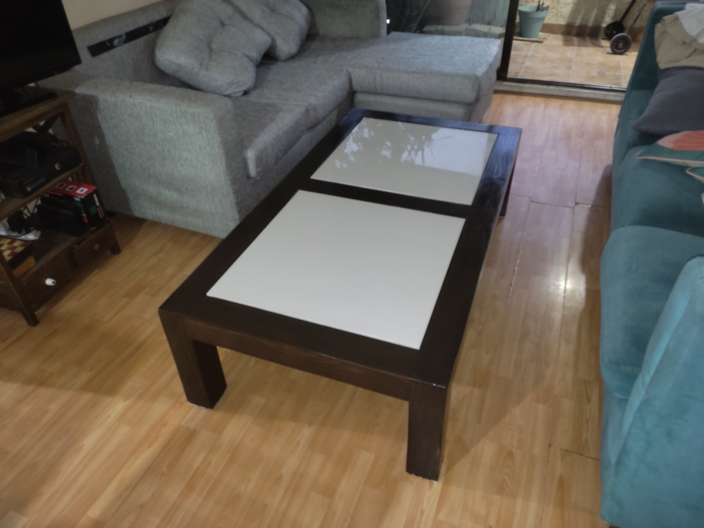

# Parametric woodworking designs for household furniture

This repository hold a collection of my personal designs for woodworking projects. Only some got to actual manufaturing.

All designs are built using FreeCAD.

## Coffee table

**Files**

[coffee_table.FCStd](coffee_table/coffee_table.FCStd)

**Parameters**

The following design parameters are modifiable using the embedded worksheet:

 - Table height
 - Lumber width (only square profile)
 - Center tile dimensions (only square tiles)

**Design file**
[coffee_table_01.pdf](coffee_table/coffee_table_01.pdf)

**Result**

## Terrace Bench

**Files**

[terrace_bench.FCStd](terrace_bench/terrace_bench.FCStd)

**Parameters**

The following design parameters are modifiable using the embedded worksheet:

 - Bench height
 - Bench length
 - Bench width
 - Lumber width (only square profile)

**Design file**

[terrace_bench_01.pdf](terrace_bench/terrace_bench_01.pdf)

**Result**

