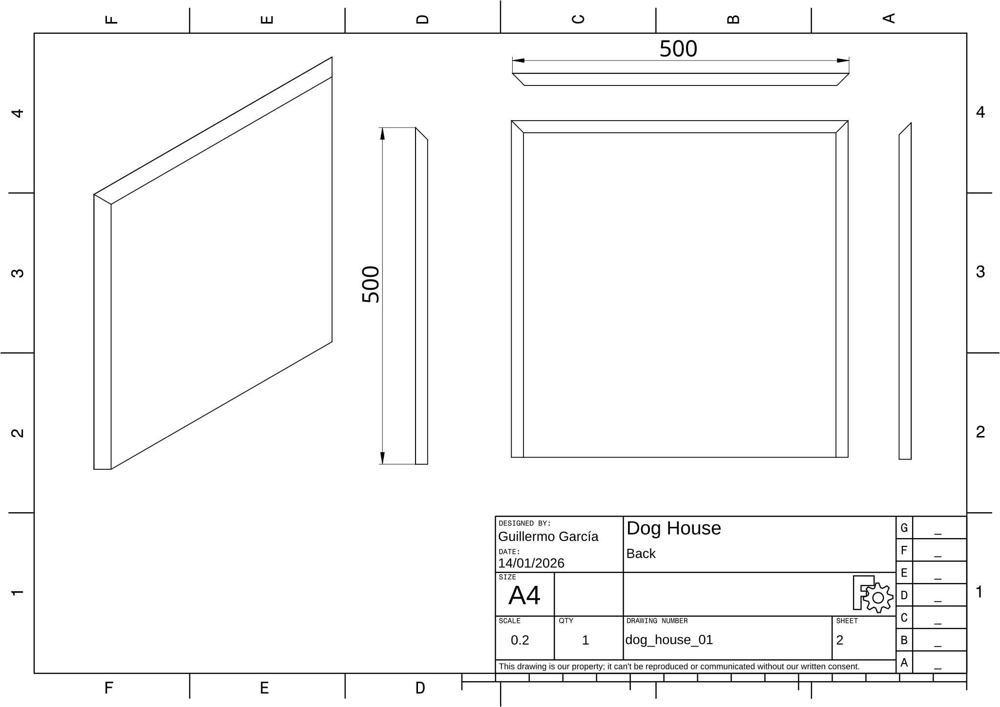
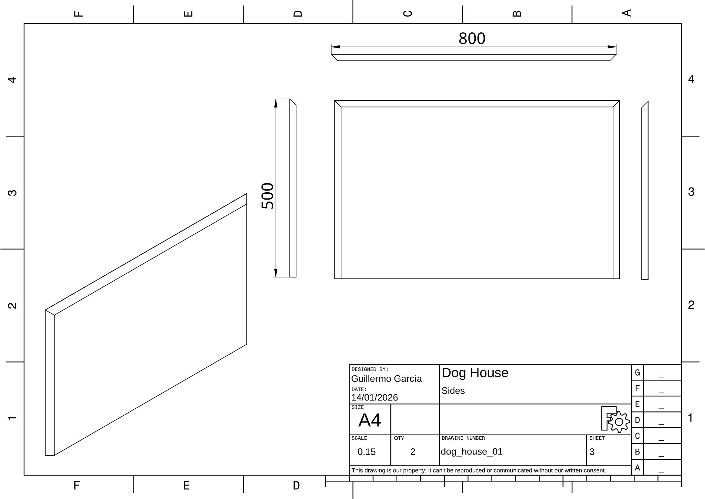
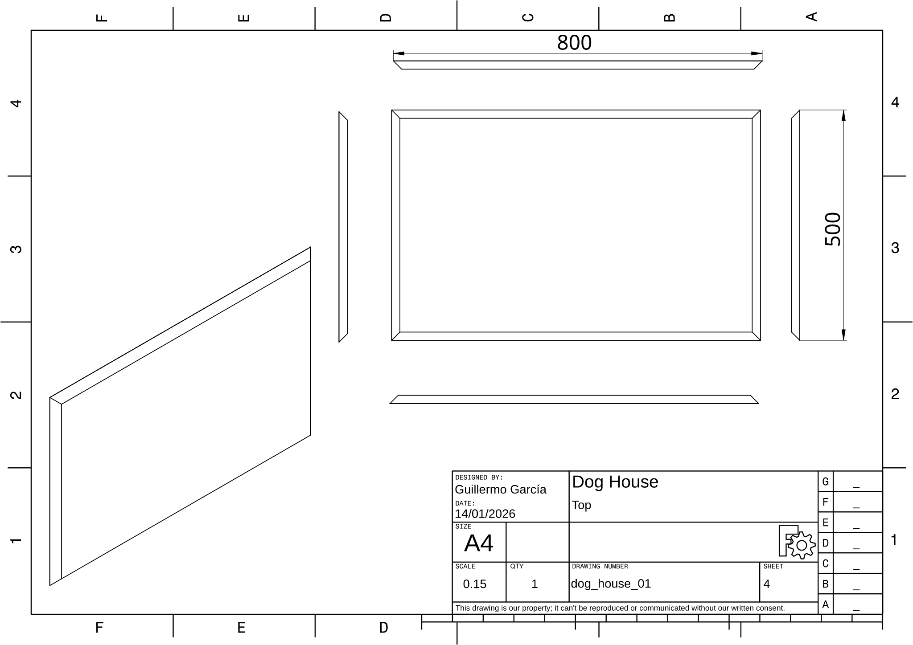
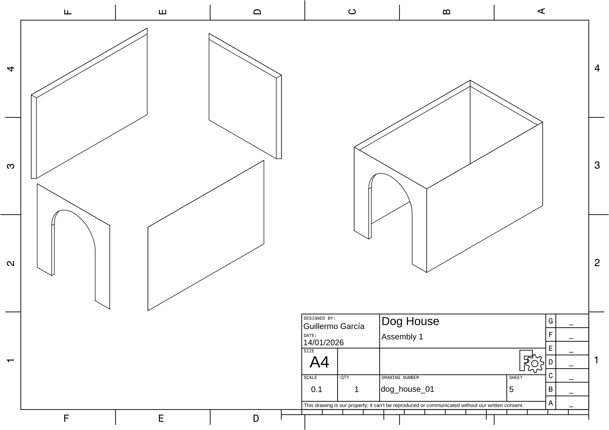
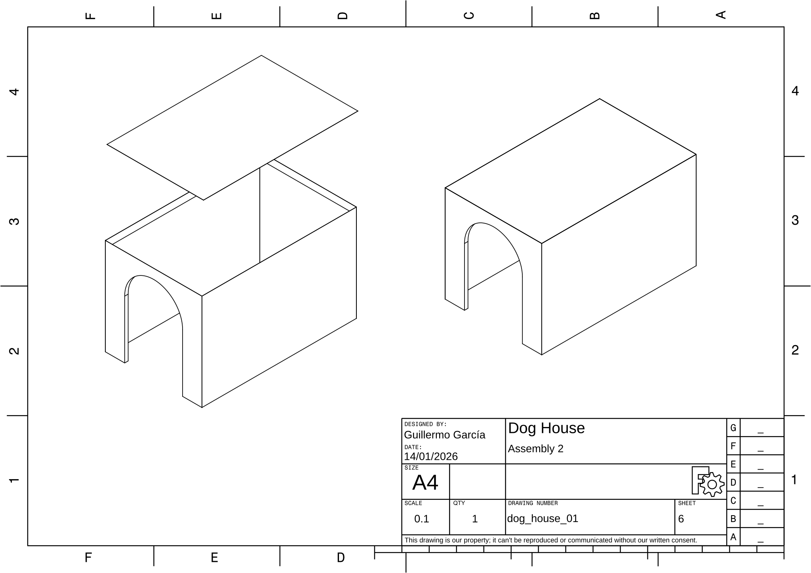

# Dog House

## Project Files

- **FreeCAD File:** [dog_house_01.FCStd](dog_house_01.FCStd)
- **PDF Output:** [dog_house_01.pdf](dog_house_01.pdf)

## Dimensions

| Parameter | Value |
|-----------|-------|
| Project Title | Dog House |
| Project Code | dog_house_01 |
| Author | Guillermo García |
| Date | 14/01/2026 |
| Height | 500 |
| Width | 500 |
| Length | 800 |
| Door Width | 300 |
| Plywood width | 18 |

## Drawings

### Front 

**Drawing:** dog_house_01 | **Sheet:** 1

### Back 

**Drawing:** dog_house_01 | **Sheet:** 2

### Sides

**Drawing:** dog_house_01 | **Sheet:** 3

### Top 

**Drawing:** dog_house_01 | **Sheet:** 4

### Assembly 1

**Drawing:** dog_house_01 | **Sheet:** 5

### Assembly 2

**Drawing:** dog_house_01 | **Sheet:** 6

