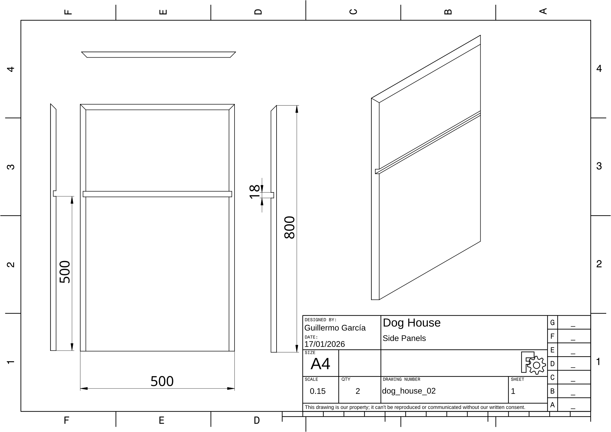
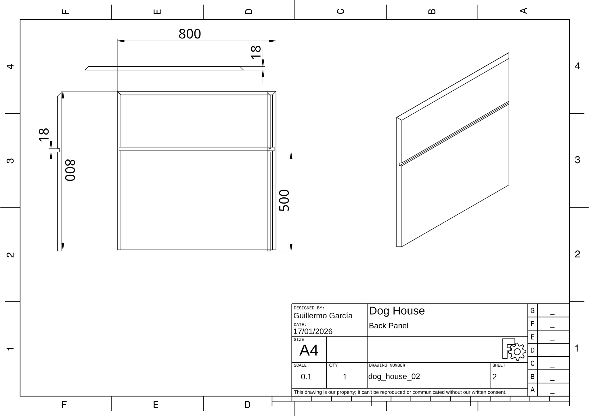
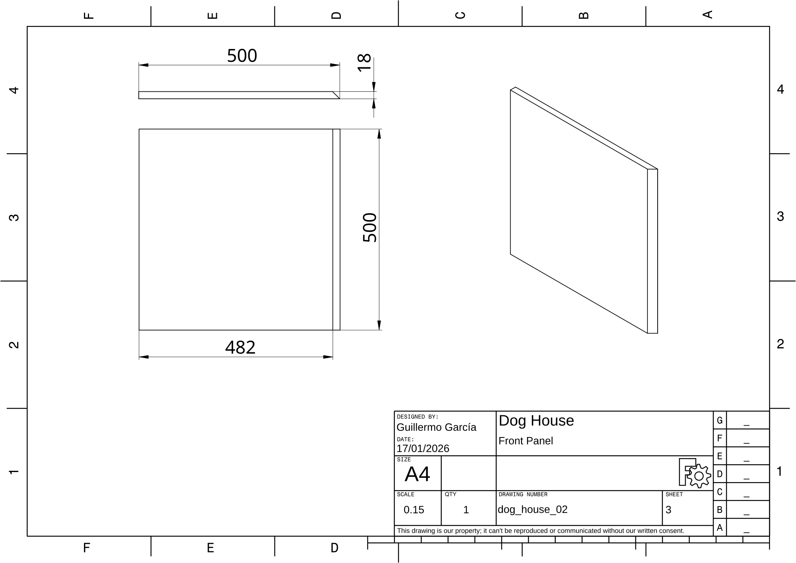
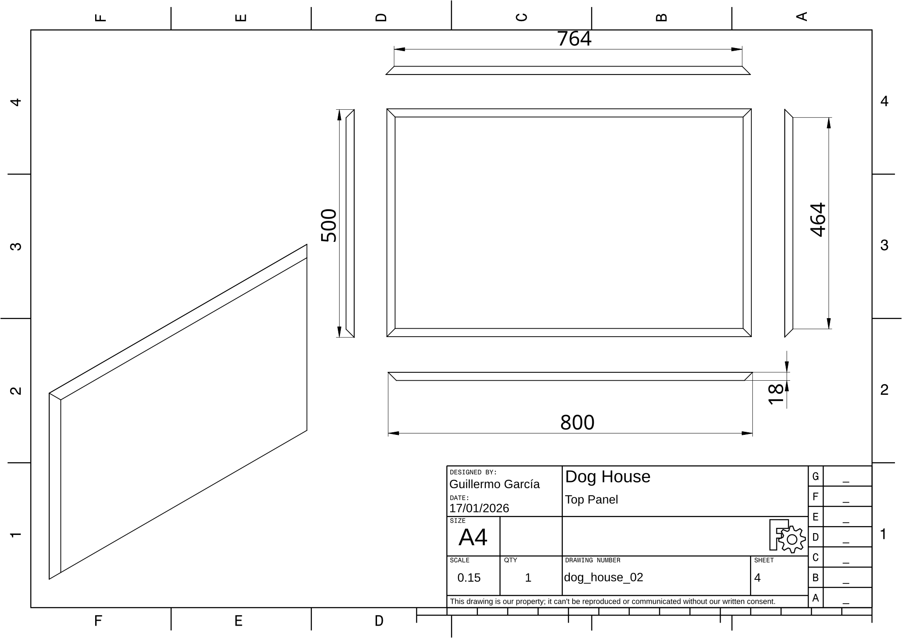
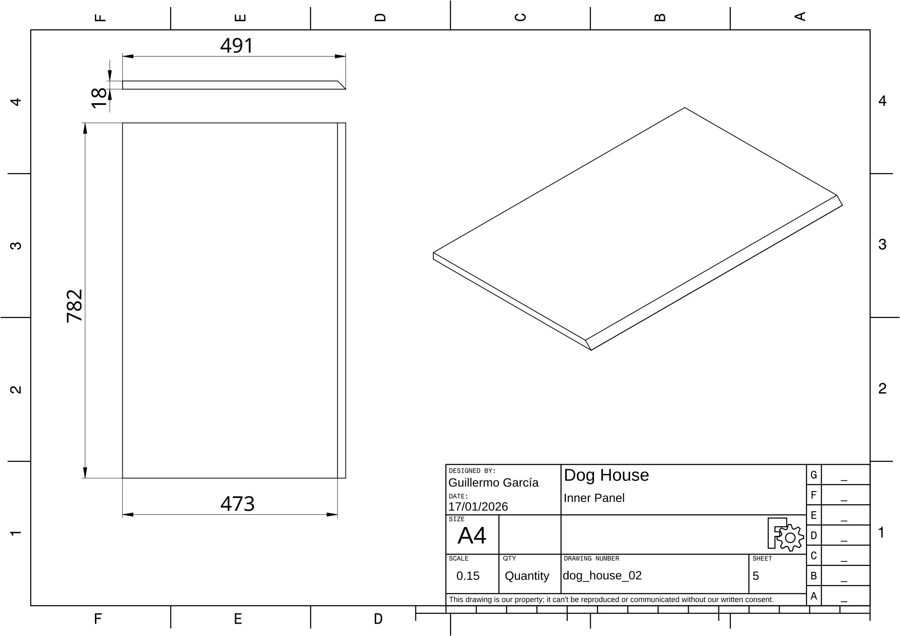
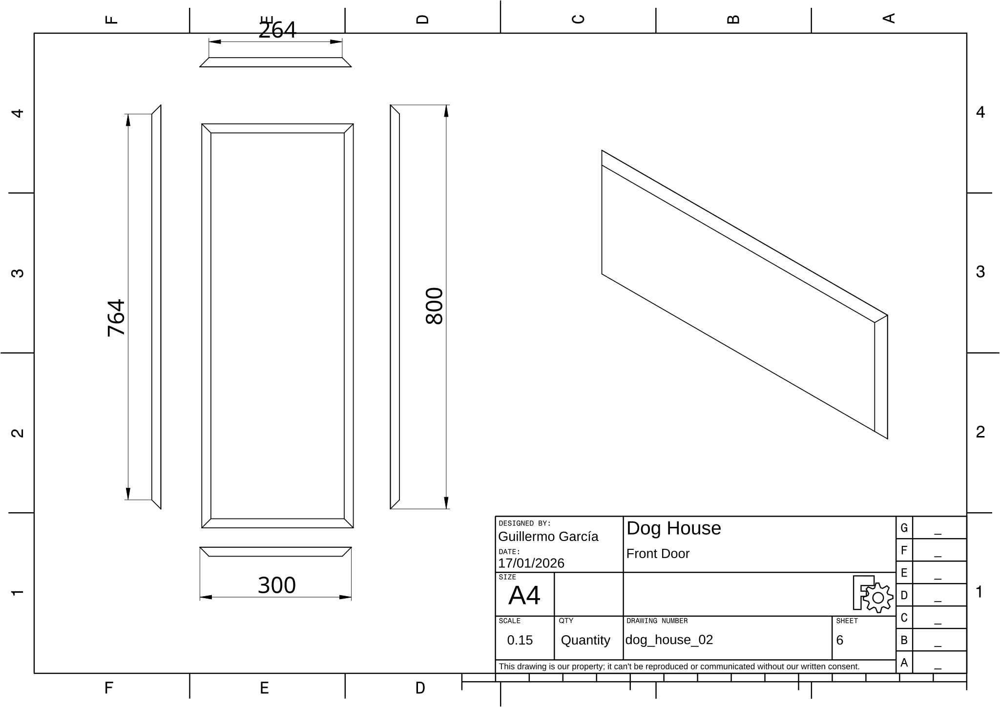
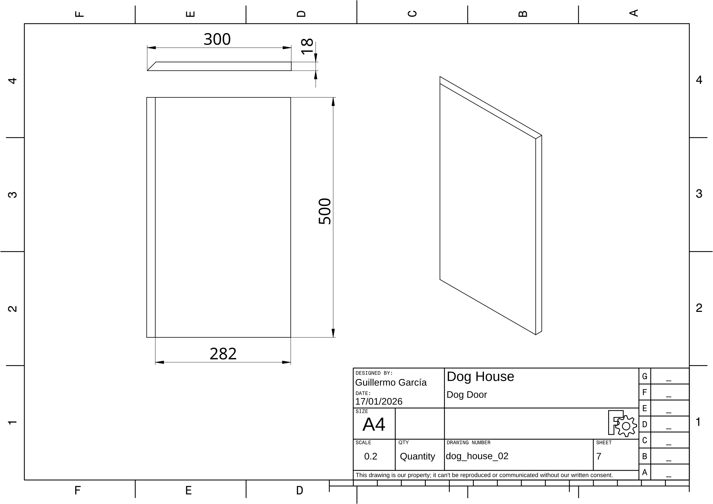
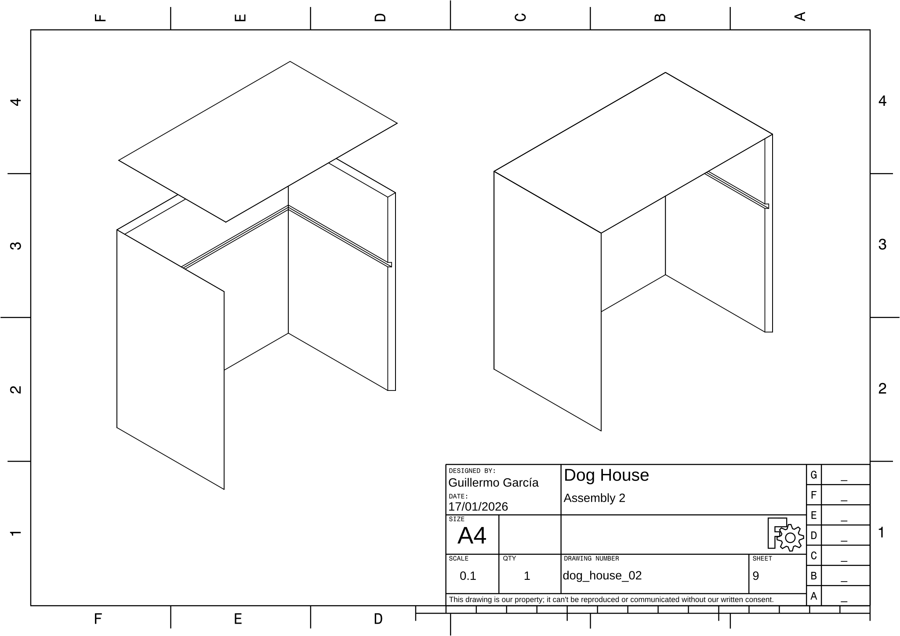
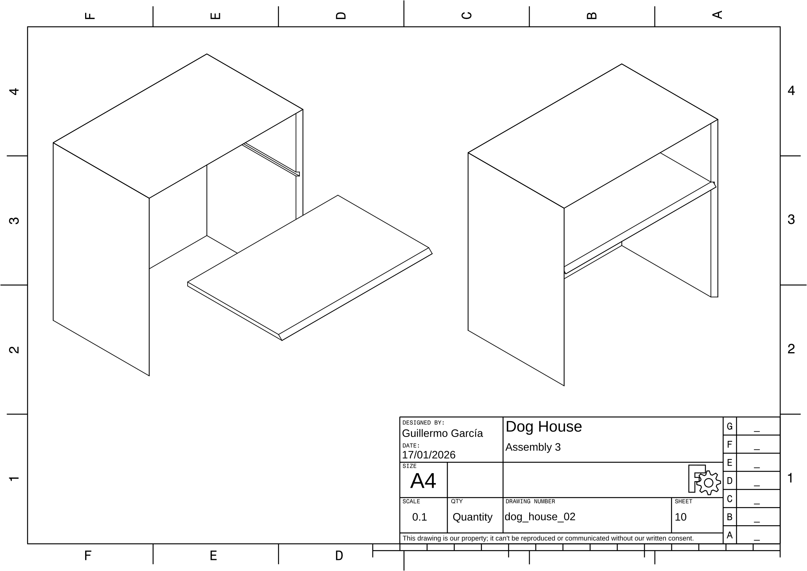
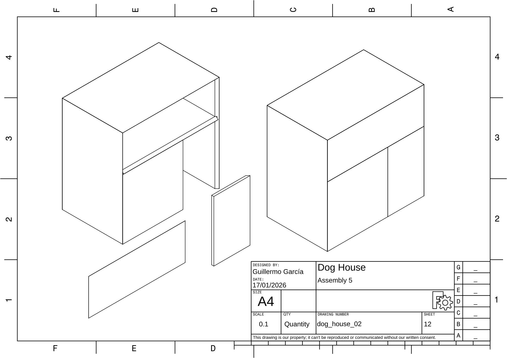

# Dog House

## Project Files

- **FreeCAD File:** [dog_house_02.FCStd](dog_house_02.FCStd)
- **PDF Output:** [dog_house_02.pdf](dog_house_02.pdf)

## Dimensions

| Parameter | Value |
|-----------|-------|
| Project Title | Dog House |
| Project Code | dog_house_02 |
| Author | Guillermo García |
| Date | 17/01/2026 |
| Height | 800 |
| Inner Height | 500 |
| Width | 500 |
| Length | 800 |
| Door Width | 300 |
| Plywood width | 18 |

## Drawings

### Side Panels

**Drawing:** dog_house_02 | **Sheet:** 1

### Back Panel

**Drawing:** dog_house_02 | **Sheet:** 2

### Front Panel

**Drawing:** dog_house_02 | **Sheet:** 3

### Top Panel 

**Drawing:** dog_house_02 | **Sheet:** 4

### Inner Panel

**Drawing:** dog_house_02 | **Sheet:** 5

### Front Door

**Drawing:** dog_house_02 | **Sheet:** 6

### Dog Door 

**Drawing:** dog_house_02 | **Sheet:** 7

### Assembly 1

**Drawing:** dog_house_02 | **Sheet:** 8

### Assembly 2

**Drawing:** dog_house_02 | **Sheet:** 9

### Assembly 3

**Drawing:** dog_house_02 | **Sheet:** 10

### Assembly 4

**Drawing:** dog_house_02 | **Sheet:** 11

### Assembly 5

**Drawing:** dog_house_02 | **Sheet:** 12

