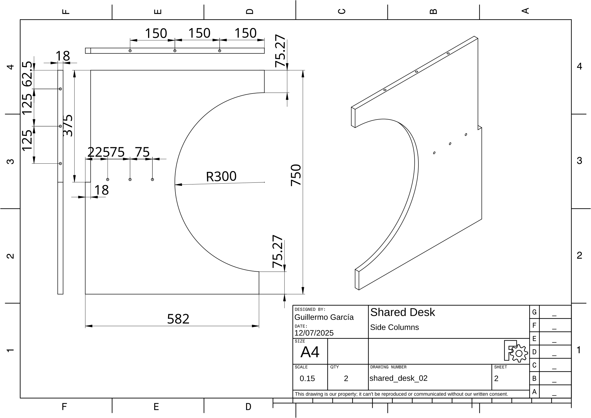
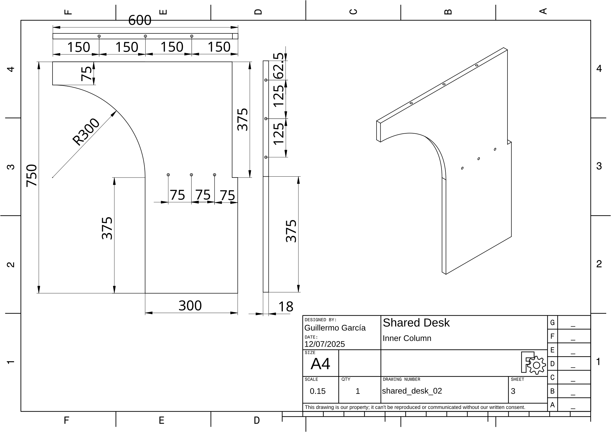
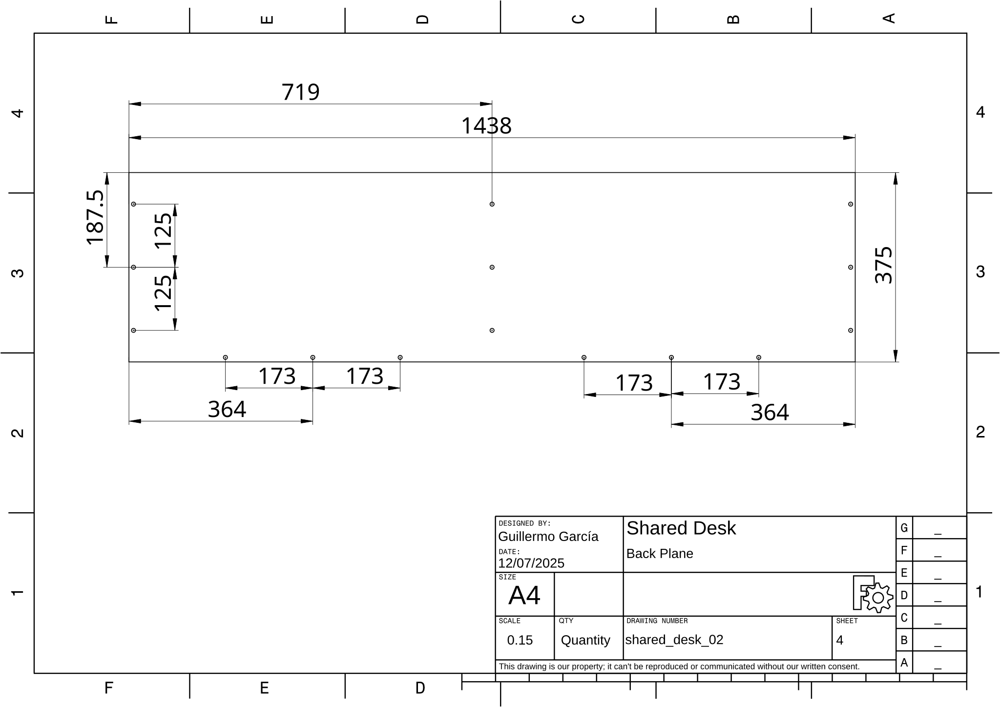
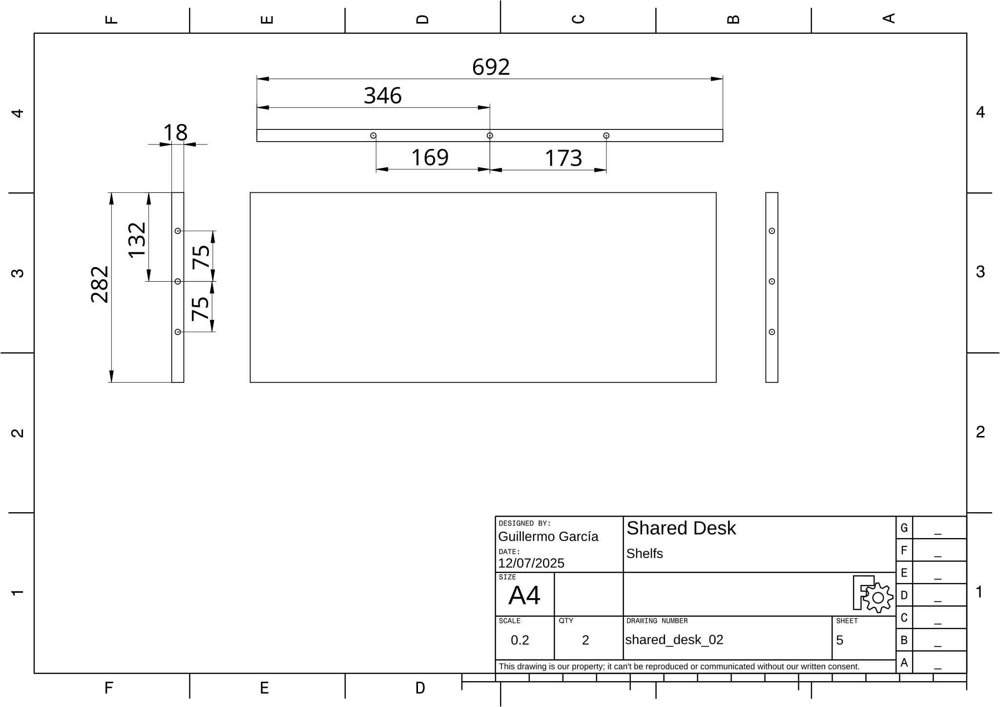
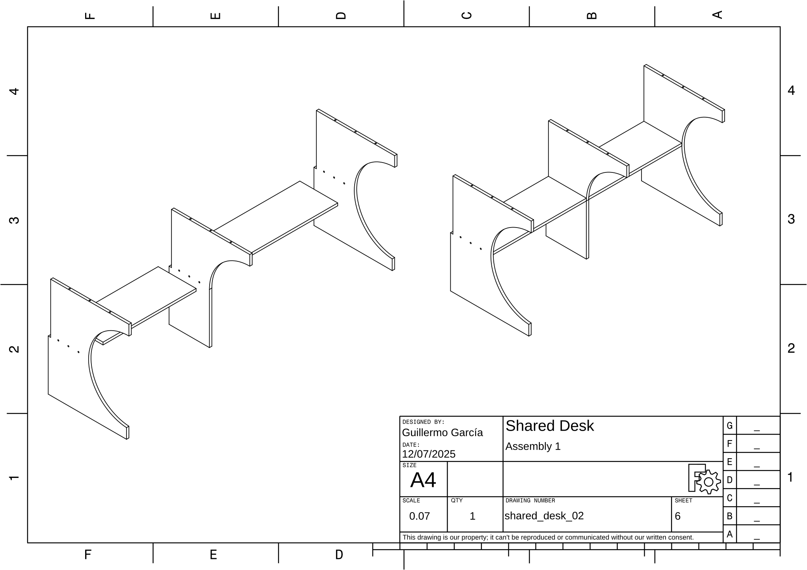
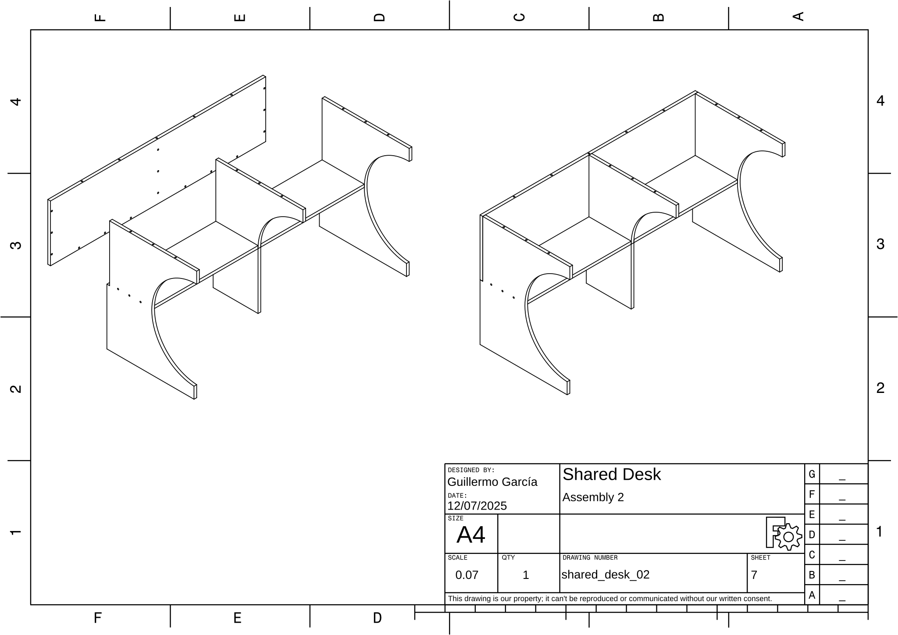
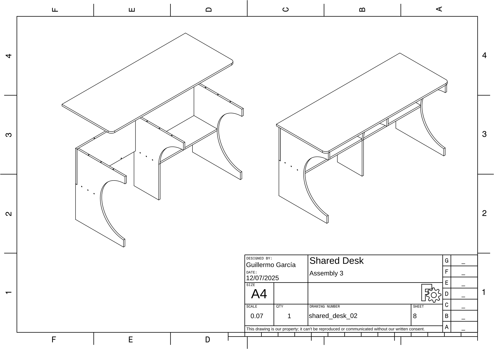
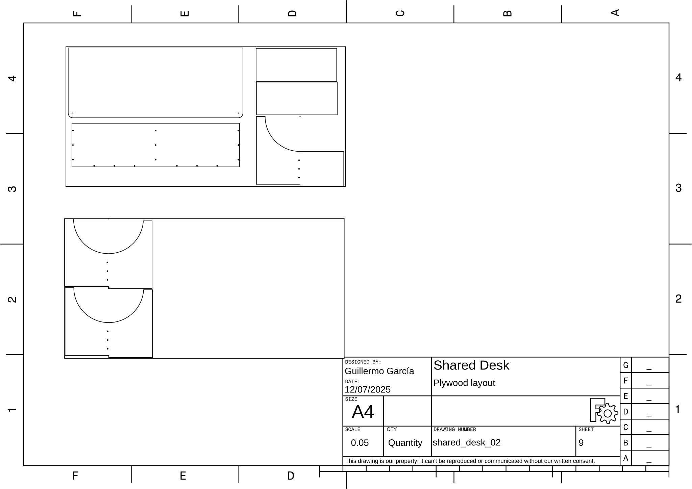

# Shared Desk

## Project Files

- **FreeCAD File:** [shared_desk_2.FCStd](shared_desk_2.FCStd)
- **PDF Output:** [shared_desk_02.pdf](shared_desk_02.pdf)

## Dimensions

| Parameter | Value |
|-----------|-------|
| Project Title | Shared Desk |
| Project Code | shared_desk_02 |
| Author | Guillermo García |
| Date | 12/07/2025 |
| Lumber width | 40 |
| Plywood width | 18 |
| Dowel diameter | 8 |
| Dowel length | 40 |
| Bit diameter | 12 |
| Desk Length 1 | 1500 |
| Desk Length 2 | 1500 |
| Desk Height | 750 |
| Desk Width | 600 |
| Crossbar Height | 300 |
| Plywood L1 | 2400 |
| Plywood L2 | 1200 |

## Drawings

### Desk Cover

**Drawing:** shared_desk_02 | **Sheet:** 1

### Side Columns

**Drawing:** shared_desk_02 | **Sheet:** 2

### Inner Column

**Drawing:** shared_desk_02 | **Sheet:** 3

### Back Plane 

**Drawing:** shared_desk_02 | **Sheet:** 4

### Shelfs

**Drawing:** shared_desk_02 | **Sheet:** 5

### Assembly 1

**Drawing:** shared_desk_02 | **Sheet:** 6

### Assembly 2

**Drawing:** shared_desk_02 | **Sheet:** 7

### Assembly 3

**Drawing:** shared_desk_02 | **Sheet:** 8

### Plywood layout

**Drawing:** shared_desk_02 | **Sheet:** 9

## Images

### test 01

